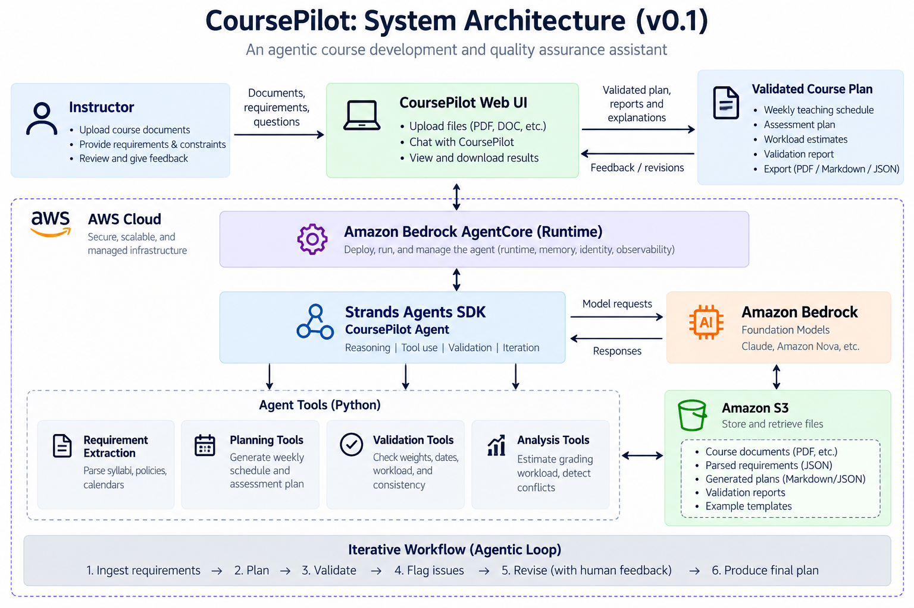

# CoursePilot-Agent

**Agentic course planning with deterministic quality assurance and human-in-the-loop review.**

CoursePilot converts structured course requirements into a proposed course plan using
**Strands Agents SDK + Amazon Bedrock**, validates hard constraints with deterministic
Python rules, and returns conflicts and recommendations for **instructor review**.

> **MVP status:** The end-to-end local workflow is operational. Structured course
> requirements are processed by Strands + Amazon Bedrock + Amazon Nova 2 Lite,
> converted into a structured `CoursePlan`, checked by deterministic validators,
> and returned with an instructor-facing review.

## Why CoursePilot?

Course development is not simply a content-generation task. Instructors must coordinate:

- weekly topics and schedules
- assessments and grading weights
- labs and projects
- course policies and constraints
- teaching-assistant workloads
- dates and dependencies

A generative model can help with planning and reasoning, but important course rules
should not depend on probabilistic generation alone.

CoursePilot therefore separates **AI-assisted planning** from **deterministic validation**.

> **Design principle:** Use the LLM for planning and reasoning; use deterministic
> Python for rules.

## How it works

```text
Structured course requirements
            |
            v
     Strands Agents SDK
            |
            v
 Amazon Bedrock / Nova 2 Lite
            |
            v
   Structured CoursePlan
            |
            v
 Deterministic Python validation
            |
       +----+----+
       |         |
     valid     conflict
       |         |
       v         v
   Final plan   Instructor review
```

## Architecture

- **Strands Agents SDK** — agent execution and structured output
- **Amazon Bedrock** — managed foundation-model access
- **Amazon Nova 2 Lite** — current planning/reasoning model
- **Deterministic Python validators** — rule checking for weights, assessment
  names, course weeks, and grading workload
- **Amazon Bedrock AgentCore** — planned managed runtime / observability layer
- **Amazon S3** — planned document and artifact storage
  
AgentCore and S3 are intentionally outside this integration step. The present
goal is to make the existing CoursePilot MVP work end to end before adding more
AWS infrastructure.
<p align="center">
  
</p>

## Example: catching a conflicting assessment plan

The sample input intentionally contains a course-design conflict:

```json
{
  "assessments": [
    {"name": "In-class exercises", "weight": 10, "week": 13},
    {"name": "Labs", "weight": 10, "week": 10},
    {"name": "Midterm", "weight": 30, "week": 8},
    {"name": "Project", "weight": 20, "week": 13},
    {"name": "Final exam", "weight": 35, "week": 13}
  ]
}
```
These weights total **105%**, even though the course requirements state that
assessment weights must total 100%.

CoursePilot instructs the planning model to preserve explicitly supplied
assessment values rather than silently changing them. The generated plan is
then checked by deterministic Python validators.

For this sample conflict, the weight validator reports:

```json
{
  "valid": false,
  "total_weight": 105.0,
  "difference_from_100": 5.0,
  "message": "Assessment weights total 105.0%, not 100%."
}
```
Because deterministic validation fails, the pipeline status becomes:

```text
needs_instructor_review
```
The instructor-review step can explain the conflict and suggest correction
options, but it does not automatically change instructor-defined assessment
weights.

This illustrates the central CoursePilot pattern:

> **LLM planning → deterministic validation → human decision**

## Repository structure

```text
src/coursepilot/
├── __init__.py
├── __main__.py
├── agent.py
├── tools.py
└── validators.py
```

### Main responsibilities

- `agent.py`
  - configures Strands + Amazon Bedrock
  - defaults to Amazon Nova 2 Lite
  - defines the structured `CoursePlan`
  - generates the proposed plan
  - generates the instructor-facing review

- `__main__.py`
  - loads CoursePilot JSON input
  - calls the planning step
  - runs deterministic validators
  - checks that instructor-defined assessment values were not changed
  - produces a single JSON result

- `validators.py`
  - remains the deterministic rules layer
  - checks assessment weights, names, weeks, and grading workload

- `tools.py`
  - retains Strands tool wrappers for future interactive/agent workflows
  - is not required for the main deterministic-validation path

## Quick start

### 1. Clone the repository

```bash
git clone https://github.com/FlosMume/CoursePilot-Agent.git
cd CoursePilot-Agent
```

### 2. Create a virtual environment

Linux / macOS / WSL:

```bash
python -m venv .venv
source .venv/bin/activate
```

Windows PowerShell:

```powershell
python -m venv .venv
.venv\Scripts\Activate.ps1
```

### 3. Install dependencies

```bash
pip install -r requirements.txt
```

### 4. Configure AWS and the Bedrock model

CoursePilot requires AWS credentials with permission to invoke the selected
Amazon Bedrock model.

Linux / macOS / WSL:

```bash
export AWS_REGION=us-west-2
export COURSEPILOT_MODEL_ID=global.amazon.nova-2-lite-v1:0
```

Windows PowerShell:

```powershell
$env:AWS_REGION="us-west-2"
$env:COURSEPILOT_MODEL_ID="global.amazon.nova-2-lite-v1:0"
```

### 5. Run the sample workflow

Linux / macOS / WSL:

```bash
PYTHONPATH=src python -m coursepilot examples/sample_course_requirements.json
```

The output is structured JSON containing:

```text
pipeline
model
status
course_plan
validation
instructor_review
```

With the included sample input, the assessment weights total 105%, so the
deterministic validator should flag the conflict and the pipeline should require
instructor review.

### 6. Run the tests

```bash
PYTHONPATH=src python -m unittest discover -s tests -v
```

## Current capabilities

### Agentic planning

- generates a structured `CoursePlan` from course requirements
- uses Strands Agents SDK with Amazon Bedrock
- currently defaults to Amazon Nova 2 Lite
- produces an instructor-facing review after validation

### Deterministic quality assurance

CoursePilot currently checks:

- assessment weights total exactly 100%
- assessment names are unique
- assessment week numbers fall within the course length
- instructor-defined assessment weights and weeks are preserved through the
  LLM planning step
- grading workload can be estimated from enrollment and marking-time inputs

The deterministic validation layer remains authoritative for rule-based checks.

## Roadmap

### Current MVP

- [x] structured JSON course requirements
- [x] Strands + Amazon Bedrock planning workflow
- [x] structured `CoursePlan` output
- [x] deterministic Python validation
- [x] source-assessment integrity checking
- [x] instructor-facing review
- [x] local end-to-end execution
- [x] deterministic unit tests

### Next AWS phase

- [ ] package and deploy the CoursePilot agent with Amazon Bedrock AgentCore
- [ ] add Amazon S3 for course inputs, generated plans, and review artifacts
- [ ] add observability and run history
- [ ] expand the instructor-review workflow
- [ ] add richer validation and course-planning rules

## Hackathon

**Track:** Professional Agents

## License

MIT License.
